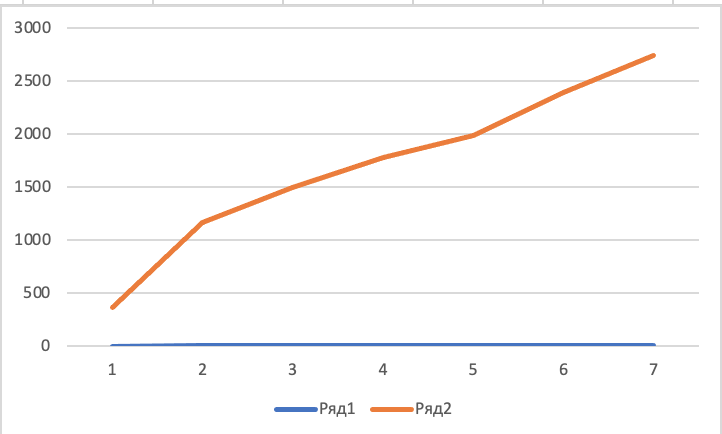

# Лабораторная 3

Планировщик задач. 

Приоритет - это целое положительное число, находящееся в некотором диапазоне, например от 0 до 7, от 0 до 4095. Будем считать, что чем меньше значение числа, тем выше приоритет процесса.

Главный недостаток приоритетного планирования заключается в возможности блокирования на неопределенно долгий срок низко приоритетных процессов.
Для исправления отмеченного недостатка используются следующие методы .: Процессы, время ожидания которых превышает фиксированную величину

## Структура
Структура Task - наш процесс, имеет такие свойства: Id, Длительность процесса, время ожидания до выполнения, приоритет.
Класс TaskSheduler отвечает за планировку задач для выполнения процессором. Задания поступают на выполнение с учетом Priority Queue. 
Длительность выполнения процесса и его приоритет выбираются случайным образом. 

После этого каждый процесс в структуре заполняется параметром waiting time (время ожидания до выполнения процесса). На основе этих данных считается среднее время выполнения процессов по приоритету и по интенсивности.
## Результат работы
Назначение процессов

Сортировка процессов 

Среднее время в зависимости от приоритета

График зависимости среднего времени от приоритета

График зависимости среднего времени от интенсивности

